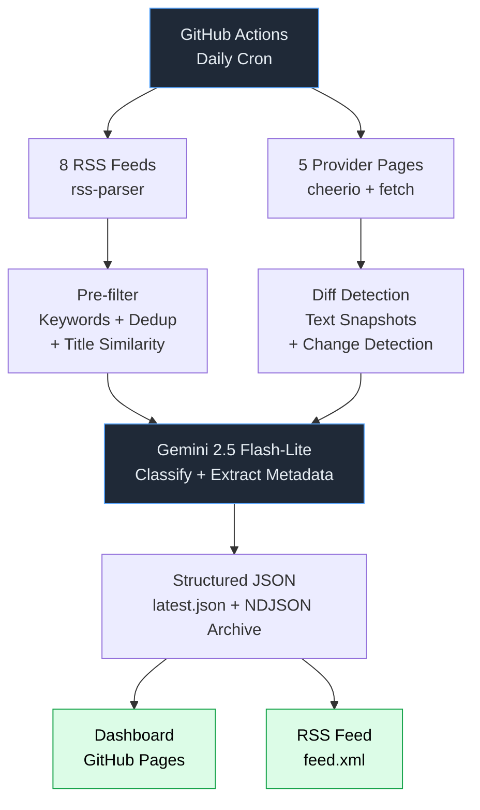

# modelsentry

**AI early warning system for developers.** Zero cost, runs entirely on GitHub.

[Live Dashboard](https://martin-minghetti.github.io/modelsentry/) · [RSS Feed](https://martin-minghetti.github.io/modelsentry/feed.xml)

---

## The Problem

Developers building on AI APIs depend on providers that change pricing, deprecate models, modify rate limits, and shift terms — often without clear notice. Staying informed means manually checking 10+ sites daily. Most devs miss critical changes until something breaks in production.

## The Solution

An automated monitor that scrapes 8 RSS feeds and diffs 5 provider pages daily, uses Gemini to classify and extract structured metadata, and serves a static dashboard + RSS feed on GitHub Pages. Fork it, add one API key, and you have your own early warning system running in under 5 minutes.

**No servers. No databases. No costs.**

---

## How It Works



| Stage | What happens |
|-------|-------------|
| **Fetch** | 8 RSS/Atom feeds parsed via `rss-parser`. 5 provider pages fetched, stripped to text with cheerio, diffed against previous snapshots. |
| **Pre-filter** | Keyword matching (include/exclude), URL deduplication against 90-day seen index, title similarity (Jaccard > 0.8 = skip). Zero tokens spent. |
| **LLM analysis** | Candidates sent to Gemini 2.5 Flash-Lite. Each item gets: category, severity, entities, event type, signal, and a one-line summary. Strict JSON validation — malformed items discarded. |
| **Persist** | Results committed to `data/`, static dashboard deployed to GitHub Pages. Archive grows ~5 MB/year. |

---

## What It Monitors

**News feeds (8 sources)**

| Source | What it brings |
|--------|---------------|
| Hacker News (AI-filtered) | Community signal on AI developments |
| r/ClaudeAI | Claude-specific community intel |
| Claude Code releases | Direct release tracking |
| Anthropic SDK Python | SDK breaking changes |
| OpenAI Blog | Official announcements |
| Google AI Blog | Official announcements |
| Simon Willison | Best individual AI analysis |
| AI News (smol.ai) | Daily digest of 449 AI accounts |

**Provider pages (diff detection)**

| Page | What it detects |
|------|----------------|
| OpenAI Pricing | Price changes |
| OpenAI Deprecations | Model retirements with dates |
| Anthropic Pricing | Price changes |
| Anthropic Model Deprecations | Model retirements with dates |
| Google Gemini Pricing | Price changes |

---

## Two Layers of Value

| Layer | What it surfaces | Why it matters |
|-------|-----------------|----------------|
| **Alerts** | Deprecations, pricing changes, breaking API changes, security vulnerabilities | What you *need* — the things that break your production if you miss them |
| **Updates** | New models, SDK releases, feature launches, funding rounds | What you *want* — the news that keeps you ahead |

---

## Quick Start

1. **Fork** this repository
2. Add `GOOGLE_API_KEY` in **Settings → Secrets → Actions** (free from [Google AI Studio](https://aistudio.google.com/apikey))
3. **Enable workflows** in the Actions tab
4. **Enable GitHub Pages** — Settings → Pages → branch `gh-pages`, folder `/ (root)`
5. Dashboard is live at `https://<your-username>.github.io/modelsentry/`

The scan runs daily at 08:00 UTC. Trigger manually from the Actions tab anytime.

---

## Configuration

Edit [`config.yaml`](./config.yaml) to customize sources, keywords, and retention:

```yaml
keywords:
  include:
    - claude
    - openai
    - model deprecation
    - pricing
  exclude:
    - crypto
    - nft

retention:
  latest_days: 30      # Items shown in dashboard
  seen_urls_days: 90   # Dedup window
```

Add or remove RSS feeds and diff-watched pages under the `sources` key. Each diff page accepts a CSS `selector` to limit the tracked region.

---

## BYOK — Bring Your Own Key

modelsentry uses **Gemini 2.5 Flash-Lite** on Google's free tier:

- **$0.00** for normal usage — well within free-tier limits
- Your key stays in your own GitHub secrets — never shared
- Swap models by changing `llm.model` in `config.yaml`

Get a free key at [aistudio.google.com/apikey](https://aistudio.google.com/apikey).

---

## Local Development

```bash
git clone https://github.com/<your-username>/modelsentry
cd modelsentry
npm install

# Run a full scan
GOOGLE_API_KEY=your-key npm run scan

# Preview the dashboard
npx serve dist

# Run tests (141 tests)
npm test
```

**Stack:** TypeScript · Node.js 20 · Vitest · rss-parser · cheerio · Gemini API · GitHub Actions · GitHub Pages

---

## License

MIT
